# HDB 租金数据分析

## 1. 分析范围与数据保护

本报告仅分析 `data/train.csv`，共 150,000 行、11 列。

- 分析过程不会覆盖、清洗、填补或导出修改后的数据集。
- 日期、房龄、标准化类别等派生变量和分析子集只存在于内存中。
- `test.csv` 不用于分布分析、特征选择或分析结论。
- 本报告暂不合并任何辅助数据集。
- 同一房屋在同一月份出现多条记录时，仅将其标记为待核查记录，不直接判定为错误。现实中可能存在多笔具有相同房屋属性的租赁审批记录。

## 2. 数据集概览

训练数据的租赁审批月份为 **2021-01 至 2025-03**，共覆盖 **51 个月**。

| 字段 | 语义类型 | R读取类型 | 缺失数量（Missing） | 缺失比例（Missing_pct） | 唯一值数量 |
|:---|:---|:---|---:|---:|---:|
|RENT_APPROVAL_DATE|时间变量（月度）|character|0|0%|51|
|TOWN|类别型位置变量|character|0|0%|26|
|BLOCK|高基数标识符|character|0|0%|2,720|
|STREET|高基数位置变量|character|0|0%|1,146|
|FLAT_TYPE|类别型房屋属性|character|0|0%|11|
|FLAT_MODEL|类别型房屋属性|character|0|0%|20|
|FLOOR_AREA_SQM|数值型房屋属性|numeric|0|0%|156|
|FURNISHED|类别型房屋属性|character|0|0%|1|
|LEASE_COMMENCE_DATE|年份／房龄相关变量|integer|0|0%|57|
|FEE|数值变量，业务含义待确认|numeric|0|0%|1|
|MONTHLY_RENT|数值型目标变量|integer|0|0%|608|

### 任务定位

本任务属于监督式表格回归，数据同时包含房屋属性、位置和时间维度。由于缺少唯一住房单元标识符，无法可靠地追踪同一套住房随时间的变化。因此，时间变量应作为预测特征进入模型，但不应将本任务表述为纯时间序列预测。

### 解读

`BLOCK` 和 `STREET` 是高基数位置字段。如果没有最低样本量限制，不应直接解释其分组租金中位数。`FEE` 的字段名称不足以安全推断其业务含义，需要结合比赛说明进一步确认。

## 3. 数据质量审计

| 检查项目 | 数量 | 占比（%） |
|:---|---:|---:|
|完全重复的记录|425|0.28|
|同一房屋—月份组合中，第一条之后的重复记录|15,547|10.37|
|`MONTHLY_RENT <= 0`|0|0.00|
|`FLOOR_AREA_SQM <= 0`|0|0.00|
|缺失或无效的 `RENT_APPROVAL_DATE`|0|0.00|
|`LEASE_COMMENCE_DATE` 晚于租赁审批年份|1|0.00|
|派生房龄小于 0|1|0.00|
|派生房龄大于 99|0|0.00|

### 稀有类别情况

| 字段 | 类别数量 | 少于20条记录的类别数量 | 稀有类别包含的记录数 |
|:---|---:|---:|---:|
|TOWN|26|0|0|
|FLAT_TYPE|11|1|8|
|FLAT_MODEL|20|3|32|
|FURNISHED|1|0|0|
|STREET|1,146|217|2,231|
|BLOCK|2,720|1,097|11,076|

### 格式一致性

| 字段 | 原始唯一值数量 | 统一大小写及空格后的唯一值数量 | 差值 |
|:---|---:|---:|---:|
|FLAT_TYPE|11|6|5|
|STREET|1,146|576|570|

| 标准化房型 | 原始形式 | 原始形式数量 |
|:---|:---|---:|
|1 room|1 room, 1-room|2|
|2 room|2 room, 2-room|2|
|3 room|3 room, 3-room|2|
|4 room|4 room, 4-room|2|
|5 room|5 room, 5-room|2|

### 解读

数据中有 **425 条完全重复记录**，以及 **15,547 条在同一房屋—月份组合中排在第一条之后的记录**。后一类记录可能代表真实的多笔租赁交易，没有额外证据时不应直接删除。

`FLAT_TYPE` 存在连字符与空格差异，例如 `5-room` 和 `5 room`；`STREET` 存在仅大小写不同的类别。后续分组分析在内存中使用明确披露的标准化标签，避免把同一业务类别拆成不同组；原始数据没有发生改变。

## 4. 目标变量分析

| 统计量 | 数值 |
|:---|---:|
|记录数|150,000.0|
|均值|2,719.0|
|中位数|2,700.0|
|标准差|749.7|
|最小值|300.0|
|1%分位数|1,300.0|
|5%分位数|1,650.0|
|25%分位数|2,100.0|
|50%分位数|2,700.0|
|75%分位数|3,200.0|
|95%分位数|4,000.0|
|99%分位数|4,600.0|
|最大值|7,600.0|

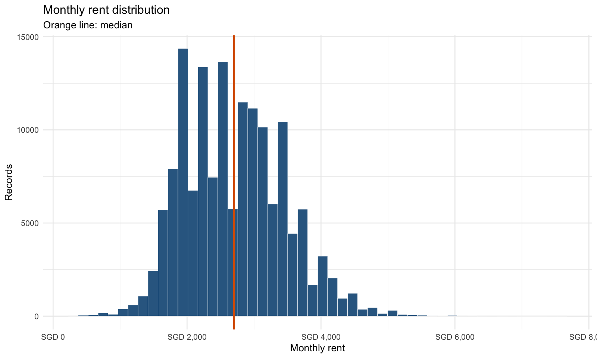

### 分布尾部对比

| 分组 | 记录数 | 租金中位数 | 面积中位数 | 最常见Town | 最常见房型 |
|:---|---:|---:|---:|:---|:---|
|最高1%|1,576|4,800|110|bukit merah|5 room|
|最低1%|1,694|1,200|67|woodlands|3 room|

### 观察与建模启示

目标变量中位数为 **SGD 2,700**，均值为 **SGD 2,719**。虽然两者接近，但仍存在明显的高租金尾部。RMSE 会对高租金样本上的大误差施加更高惩罚，因此除非发现明确的数据错误，否则应保留这些记录，并在模型误差分析阶段单独检查。

## 5. 时间分析

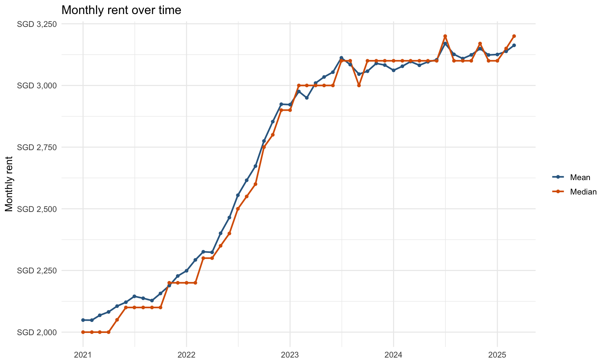

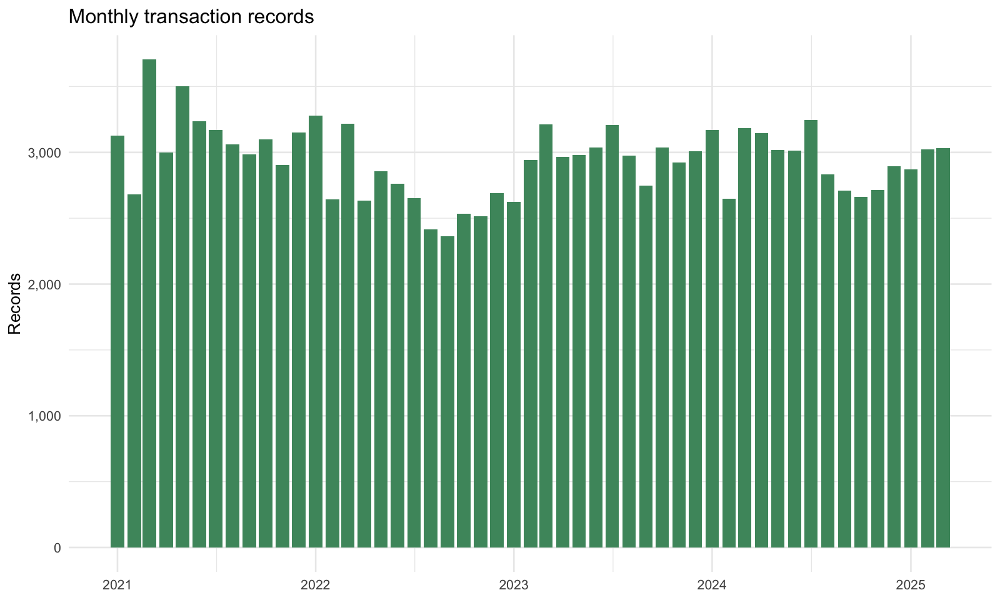

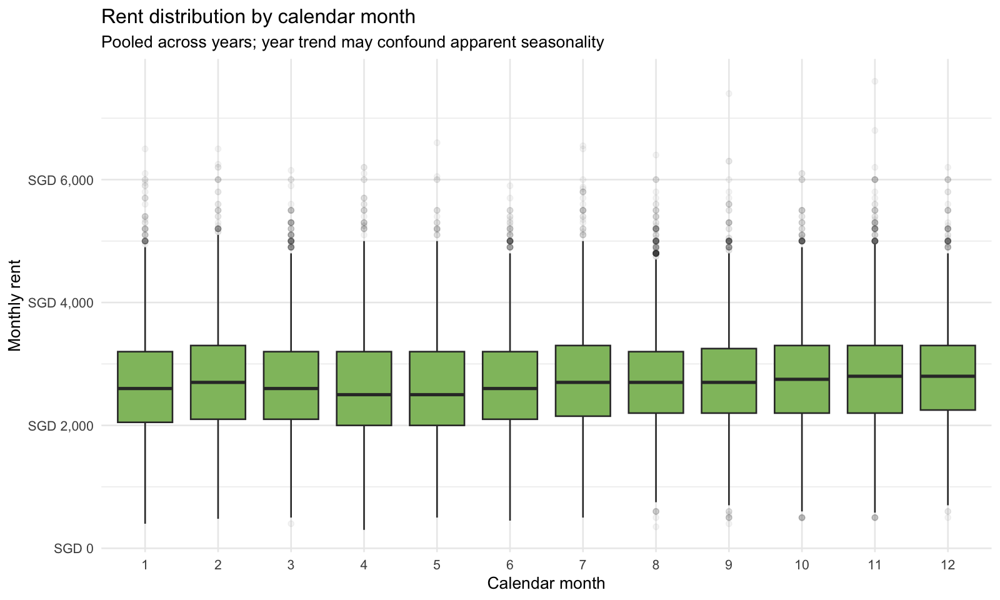

### 观察与建模启示

最后六个月的租金中位数相较最早六个月高 **56.2%**。每月记录数介于 **2,362** 与 **3,705** 之间。明显的时间变化说明应在模型中显式加入审批时间。标准随机划分或 K 折交叉验证仍适合一般模型比较，同时可增加时间留出集，用于检验模型对时间相关分布漂移的敏感性。按日历月份汇总的差异仍属于描述性结果，因为合并不同年份可能会将长期趋势与季节性混淆。

## 6. 房屋属性与租金

### 房型

| 房型 | 记录数 | 平均租金 | 租金中位数 |
|:---|---:|---:|---:|
|5 room|35,523|2,981.71|3,000|
|executive|8,234|3,069.33|3,000|
|4 room|54,079|2,837.88|2,800|
|3 room|49,024|2,386.55|2,350|
|2 room|3,098|1,979.52|2,100|
|1 room|42|1,498.21|1,450|

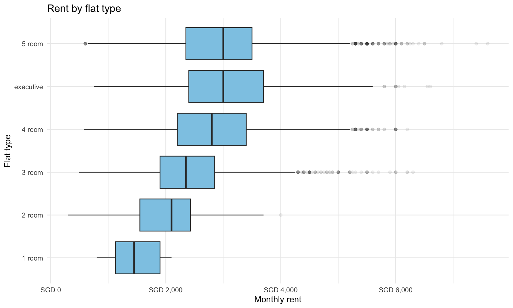

`5 room` 的租金中位数最高，为 **SGD 3,000**；`1 room` 最低，为 **SGD 1,450**。房型是重要候选特征，但它与面积高度相关，不能把房型差异完全解释为独立的房型效应。

### 建筑面积

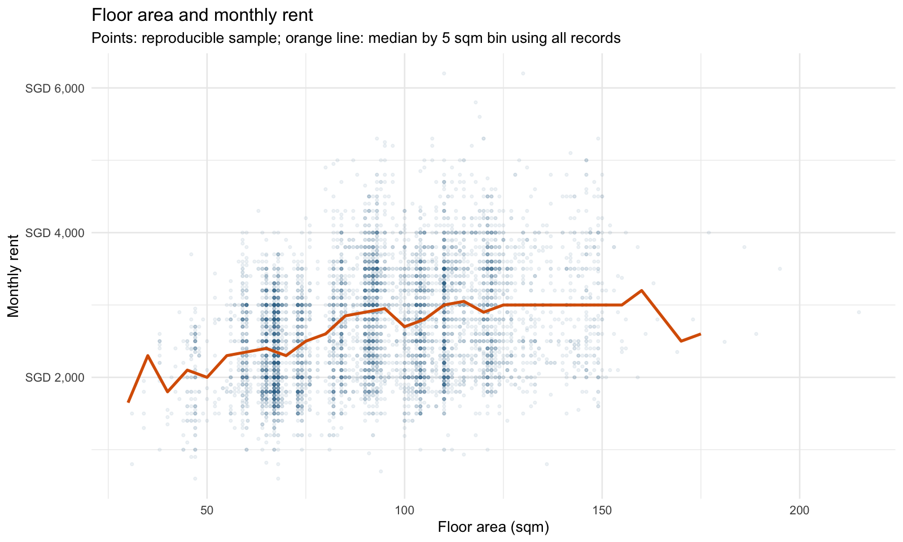

建筑面积与租金的 Spearman 相关系数为 **0.318**。面积越大，租金总体倾向于更高，但关系并非完全线性。判断关系形态时，应结合图中的分箱中位数曲线，而不能只依赖单一相关系数。

### 房屋模型

| FLAT_MODEL | 记录数 | 租金中位数 |
|:---|---:|---:|
|improved|44,008|2,700|
|model a|42,745|2,700|
|new generation|27,380|2,450|
|premium apartment|12,312|2,900|
|simplified|6,794|2,500|
|standard|5,903|2,500|
|apartment|4,724|3,000|
|maisonette|2,346|3,000|
|model a2|1,553|2,550|
|dbss|1,090|3,400|
|type s1|299|4,600|
|2 room|224|2,300|
|adjoined flat|218|3,325|
|type s2|160|4,950|
|model a maisonette|140|3,175|
|premium apartment loft|51|3,800|
|premium maisonette|21|3,300|
|terrace|19|4,200|
|3gen|12|3,500|
|improved maisonette|1|3,780|

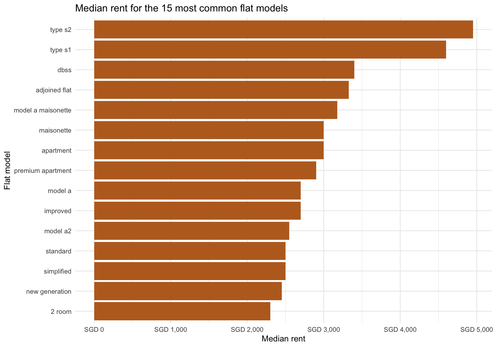

不同 `FLAT_MODEL` 的租金差异可能同时受到房型、房龄和位置影响。这些结果支持在多变量模型中保留该字段，但不能证明房屋模型本身具有因果影响。样本极少的模型也不应仅根据中位数排名得出结论。

### 家具状态

| FURNISHED | 记录数 | 租金缺失数 | 租金中位数 |
|:---|---:|---:|---:|
|yes|150,000|0|2,700|

训练集中 `FURNISHED` 只有一个取值，因此它无法区分训练集中的租金差异。

### FEE

| FEE | 记录数 | 租金中位数 |
|---:|---:|---:|
|0|150,000|2,700|

训练集中 `FEE` 恒为 0，因此它同样无法区分租金差异。在决定后续建模流程如何处理该字段之前，仍需确认其业务含义。

## 7. 位置属性与租金

| TOWN | 记录数 | 平均租金 | 租金中位数 |
|:---|---:|---:|---:|
|bukit timah|438|3,030.74|3,000|
|central|2,278|3,148.76|3,000|
|bishan|3,306|2,980.24|2,900|
|bukit merah|8,270|3,004.91|2,900|
|queenstown|6,115|2,931.30|2,900|
|punggol|6,668|2,777.37|2,850|
|pasir ris|4,089|2,841.61|2,800|
|sengkang|9,773|2,761.00|2,800|
|clementi|5,429|2,797.21|2,700|
|jurong west|10,482|2,768.43|2,700|
|kallang/whampoa|5,689|2,797.09|2,700|
|serangoon|3,398|2,772.18|2,700|
|tampines|9,942|2,764.71|2,700|
|bukit panjang|3,717|2,603.98|2,600|
|choa chu kang|5,300|2,646.13|2,600|
|jurong east|4,024|2,722.30|2,600|
|marine parade|1,637|2,690.83|2,600|
|sembawang|3,553|2,665.40|2,600|
|toa payoh|5,988|2,668.29|2,600|
|hougang|7,115|2,621.42|2,550|
|ang mo kio|8,283|2,528.25|2,500|
|bedok|8,907|2,564.58|2,500|
|bukit batok|5,605|2,579.20|2,500|
|geylang|4,504|2,595.00|2,500|
|woodlands|7,577|2,584.88|2,500|
|yishun|7,913|2,515.43|2,500|

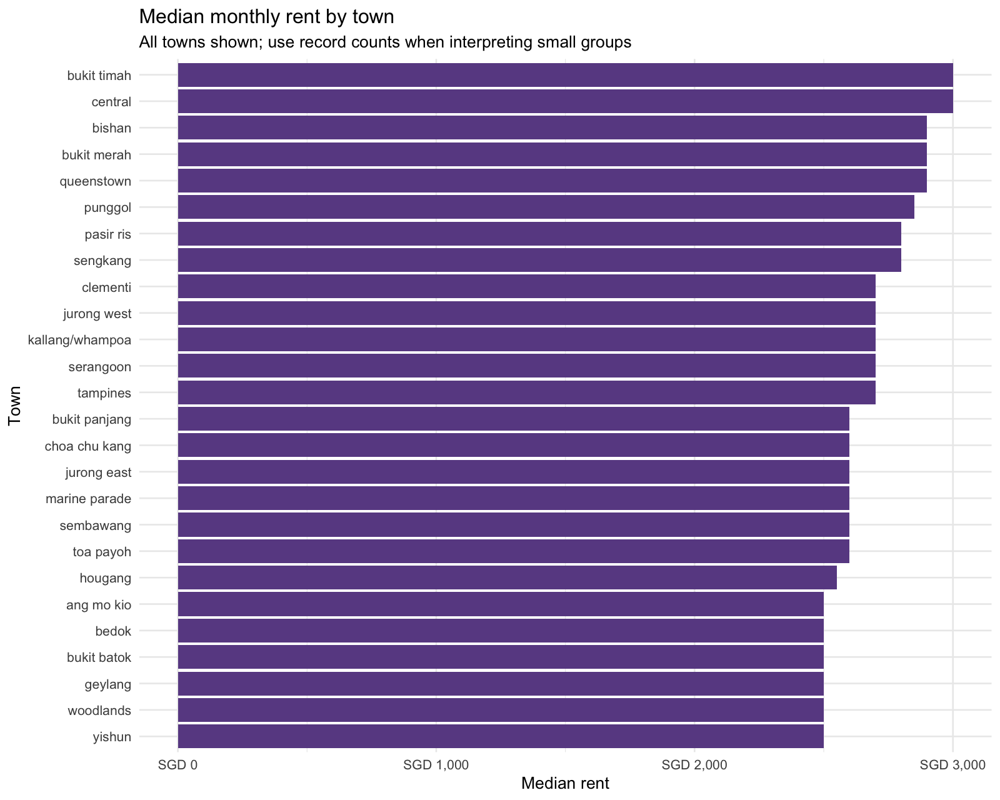

在至少有 100 条记录的 town 中，`bukit timah` 的租金中位数最高，为 **SGD 3,000**；`ang mo kio` 最低，为 **SGD 2,500**。这支持在模型中保留位置特征，并在后续实验中测试更细粒度的空间信息。

### 租金中位数最高的街道（至少50条记录）

| STREET | 记录数 | 租金中位数 | 租金四分位距 |
|:---|---:|---:|---:|
|cantonment road|459|4,700|1,400|
|lim liak street|52|4,200|1,750|
|dawson road|258|4,000|1,200|
|lorong 1a toa payoh|135|4,000|1,700|
|telok blangah street 31|206|4,000|1,000|
|henderson road|65|3,900|950|
|boon tiong road|319|3,800|1,500|
|ang mo kio street 51|55|3,600|800|
|delta avenue|86|3,600|1,200|
|kim tian place|102|3,600|1,175|
|redhill road|288|3,600|1,200|
|simei lane|65|3,600|1,050|
|boon keng road|235|3,550|1,250|
|clarence lane|75|3,500|1,100|
|ghim moh link|273|3,500|1,600|

### 租金中位数最高的楼栋（至少30条记录）

| TOWN | STREET | BLOCK | 记录数 | 租金中位数 | 租金四分位距 |
|:---|:---|:---|---:|---:|---:|
|central|cantonment road|1a|50|4,900|1,450.0|
|central|cantonment road|1f|70|4,900|1,290.0|
|central|cantonment road|1d|71|4,800|1,131.0|
|central|cantonment road|1b|66|4,700|962.5|
|central|cantonment road|1g|53|4,600|1,400.0|
|central|cantonment road|1e|72|4,550|1,325.0|
|queenstown|ghim moh link|22|31|4,500|2,050.0|
|central|cantonment road|1c|77|4,400|1,600.0|
|bukit merah|telok blangah street 31|93b|33|4,300|750.0|
|queenstown|dawson road|86|51|4,300|1,375.0|
|queenstown|dawson road|88|58|4,300|1,175.0|
|bukit merah|telok blangah street 31|90a|38|4,200|775.0|
|queenstown|dover crescent|28d|30|4,150|1,270.0|
|bukit merah|redhill road|77a|36|4,075|1,025.0|
|bukit merah|kim tian road|127d|30|4,050|1,200.0|

街道和楼栋汇总属于历史描述性统计。如果后续使用基于历史租金的目标编码，必须只利用每个验证折训练部分的数据计算，不能让验证集目标值参与编码，否则会造成数据泄漏。

## 8. 房龄分析

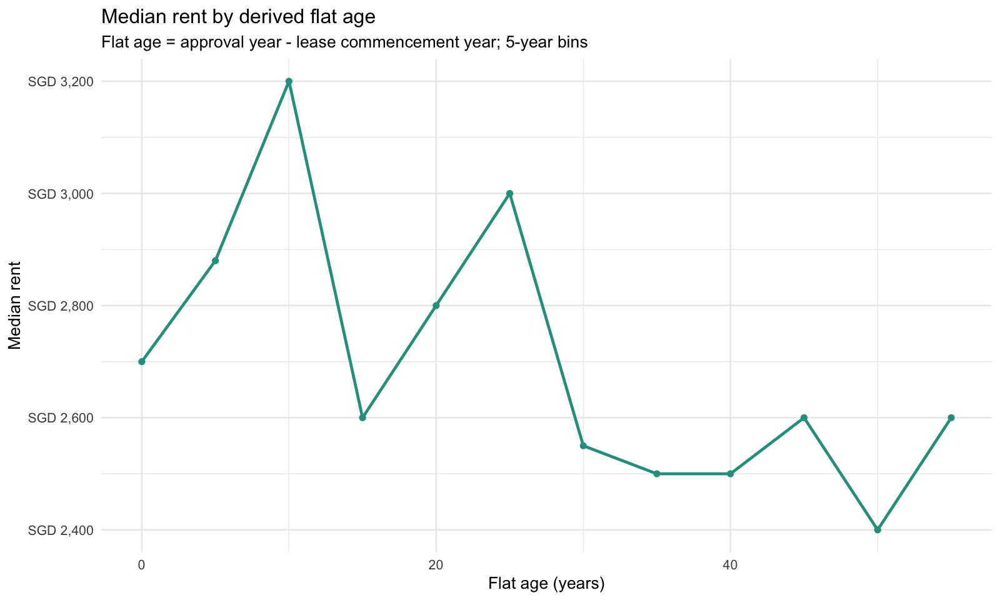

派生房龄与租金的 Spearman 相关系数为 **-0.166**。整体上房龄更大与较低租金弱相关，但该关系可能是非线性的，同时受到 town 和房型构成影响。

## 9. 交互关系分析

### Town × 房型

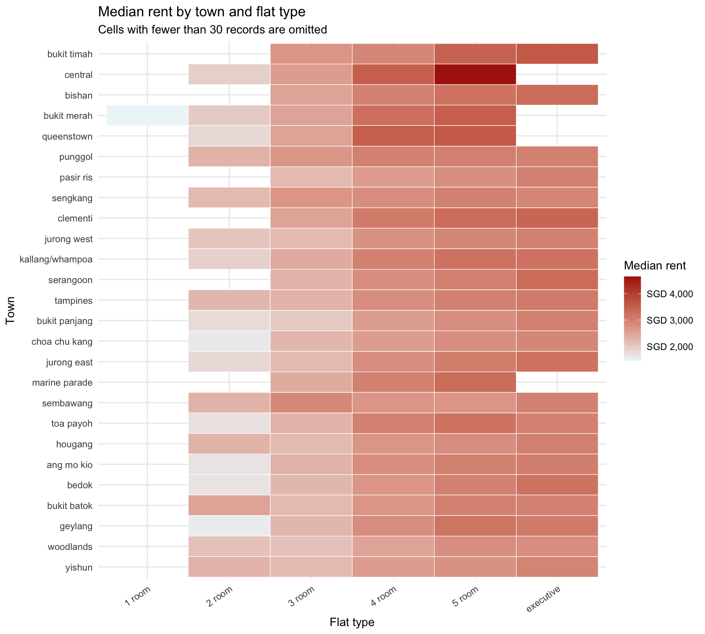

该热力图在同一房型内比较不同 town，比单独比较 town 中位数更有解释力。剩余差异仍可能受到面积、房屋模型、房龄和交易时间构成影响。

### 时间 × 房型

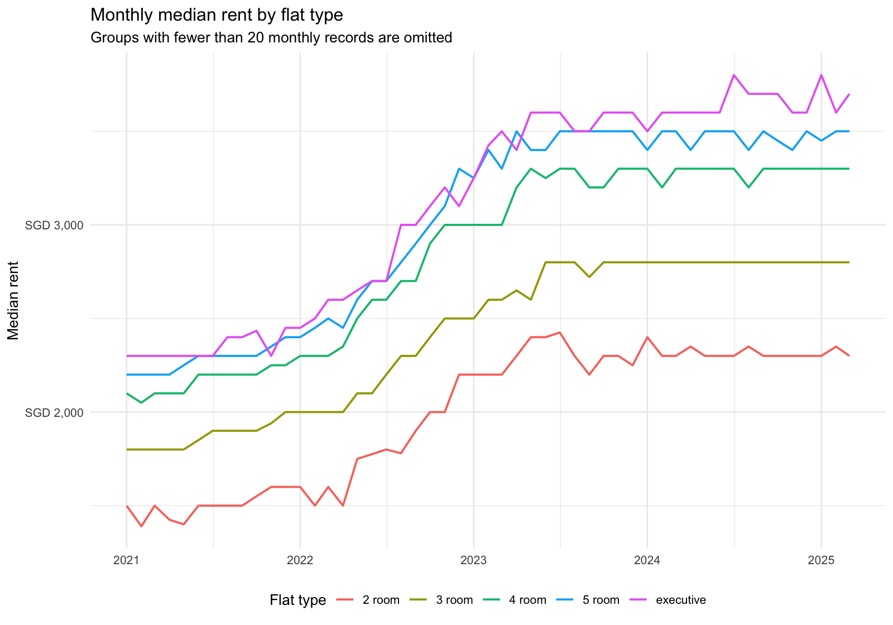

该图用于判断不同房型的租金是否随时间同步变化。如果走势明显分化，后续可考虑时间与房屋属性的交互特征，或采用能够捕捉非线性关系的树模型。

### 房型 × 面积

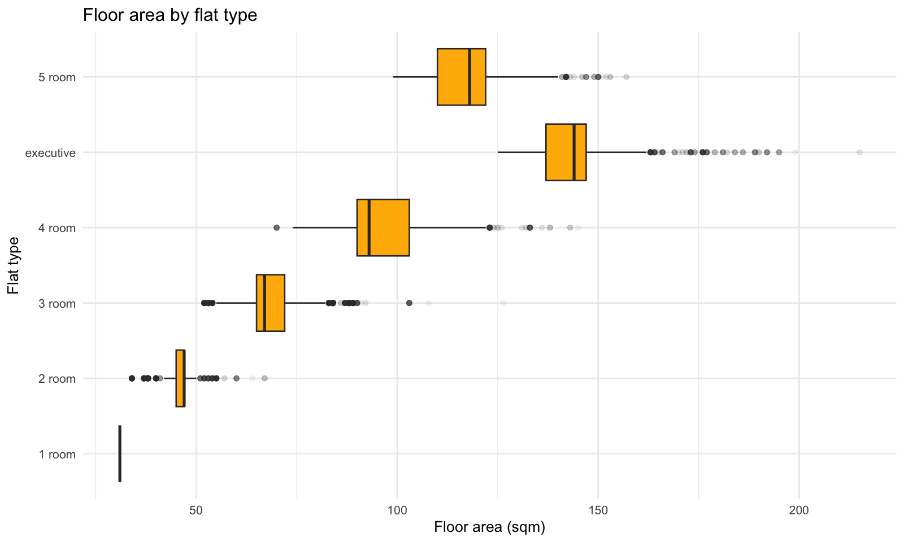

房型和面积存在明显重叠信息，但每种房型内部仍有面积差异。因此在 EDA 阶段不能把两者视为完全相同的特征。

## 10. 时间—地点分析

本节将审批时间视为横截面租赁数据的一个维度，而不是将数据视为独立的时间序列。`approval_quarter` 在内存中由 `RENT_APPROVAL_DATE` 派生。Town 标签沿用现有 EDA 的小写和空格标准化规则。

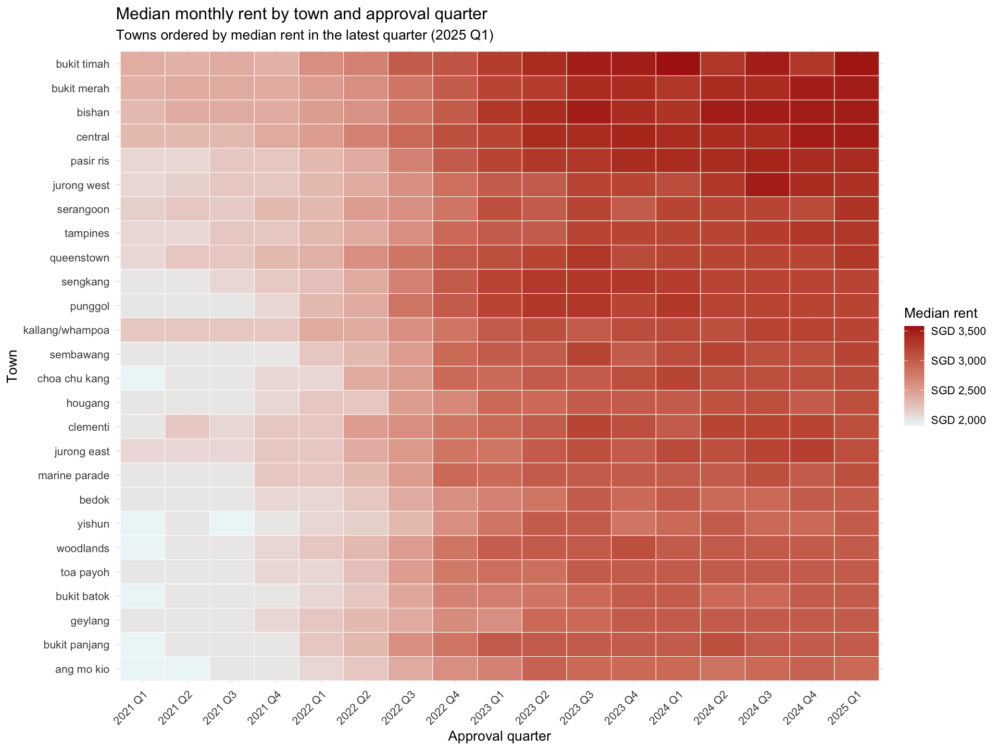

对比窗口为最早六个观测月份（**2021-01 至 2021-06**）和最后六个观测月份（**2024-10 至 2025-03**）。热力图按照最新观测季度（**2025 Q1**）的租金中位数对 town 排序。

|TOWN|记录数|早期租金中位数|后期租金中位数|绝对变化|百分比变化（%）|
|:---|---:|---:|---:|---:|---:|
|central|2,278|2,300|3,500|1,200|52.2|
|bishan|3,306|2,350|3,500|1,150|48.9|
|bukit merah|8,270|2,400|3,500|1,100|45.8|
|pasir ris|4,089|2,100|3,400|1,300|61.9|
|jurong west|10,482|2,100|3,350|1,250|59.5|
|bukit timah|438|2,350|3,350|1,000|42.6|
|tampines|9,942|2,100|3,300|1,200|57.1|
|serangoon|3,398|2,155|3,300|1,145|53.1|
|punggol|6,668|2,000|3,200|1,200|60.0|
|sengkang|9,773|2,000|3,200|1,200|60.0|
|queenstown|6,115|2,150|3,200|1,050|48.8|
|kallang/whampoa|5,689|2,200|3,200|1,000|45.5|
|jurong east|4,024|2,100|3,150|1,050|50.0|
|choa chu kang|5,300|1,900|3,100|1,200|63.2|
|sembawang|3,553|2,000|3,100|1,100|55.0|
|clementi|5,429|2,160|3,100|940|43.5|
|bukit panjang|3,717|1,900|3,000|1,100|57.9|
|woodlands|7,577|1,900|3,000|1,100|57.9|
|yishun|7,913|1,900|3,000|1,100|57.9|
|bukit batok|5,605|1,950|3,000|1,050|53.8|
|bedok|8,907|2,000|3,000|1,000|50.0|
|geylang|4,504|2,000|3,000|1,000|50.0|
|hougang|7,115|2,000|3,000|1,000|50.0|
|marine parade|1,637|2,000|3,000|1,000|50.0|
|toa payoh|5,988|2,000|3,000|1,000|50.0|
|ang mo kio|8,283|1,900|2,900|1,000|52.6|

### 解读

大多数 town 的租金随时间呈相似的上升趋势。全部 **26 个 town** 在后期六个月窗口中的租金中位数均高于早期窗口。Town 层面的增幅中位数为 **52.4%**，中间 50% 的 town 介于 **50% 至 57.9%**，并且 **26 个 town 中有 25 个**与增幅中位数的差距不超过 10 个百分点。

不同 town 之间仍存在较明显的轨迹差异。`choa chu kang`（**63.2%**）和 `pasir ris`（**61.9%**）增幅最大；`bukit timah`（**42.6%**）和 `clementi`（**43.5%**）增幅最小。

整体同步上升说明时间效应较强，而 town 之间的增幅范围和季度变化差异表明可能存在时间与位置的交互作用。这只是描述性证据，不是因果结论或纯时间序列结论。各 town 在不同时期的房型、面积、房屋模型及其他属性构成变化，可能解释部分差异。后续多变量模型可比较“仅含时间和 town 主效应”的模型与“加入时间 × town 交互项”的模型。

## 11. 时间构成分析

本节比较不同审批季度的租赁记录构成，并沿用上述两个六个月窗口：**2021-01 至 2021-06** 和 **2024-10 至 2025-03**。合并记录的月租金中位数由 **SGD 2,000** 上升至 **SGD 3,150**，增幅为 **57.5%**。以下诊断用于判断观测到的房屋构成变化是否足以合理解释其中的大部分差异。

对于类别变量，总变差距离等于各类别占比绝对变化之和的一半。它可以理解为：若要使两个时期的类别分布一致，需要在类别之间重新分配的记录比例。

### 房型构成

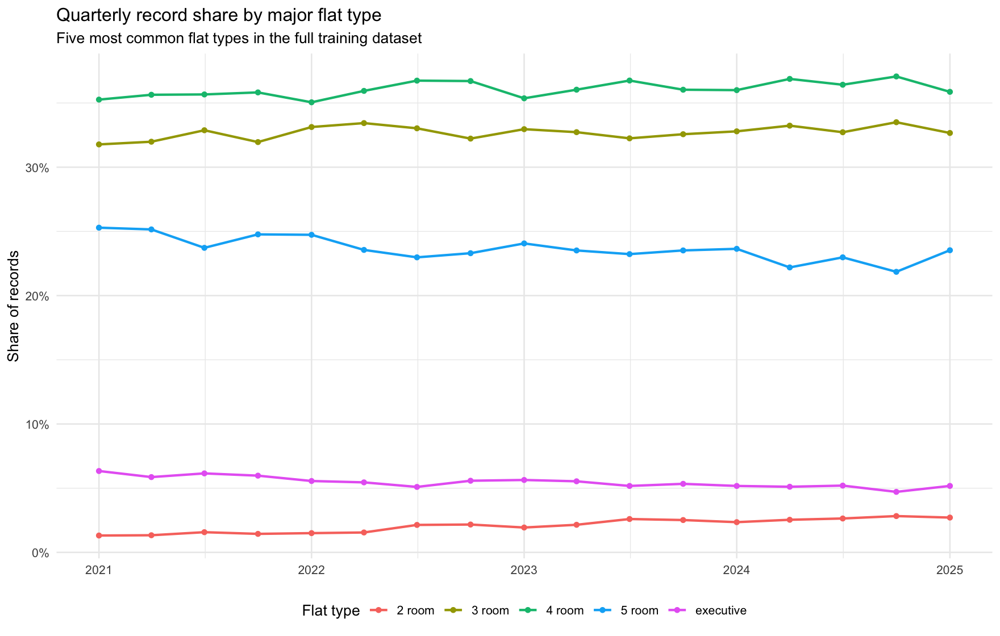

|FLAT_TYPE|早期占比（%）|后期占比（%）|变化（百分点）|
|:---|---:|---:|---:|
|5 room|25.22|22.72|-2.50|
|2 room|1.32|2.77|1.44|
|3 room|31.88|33.07|1.19|
|executive|6.10|4.95|-1.14|
|4 room|35.45|36.45|0.99|
|1 room|0.02|0.04|0.02|

房型构成的总变差距离为 **3.6 个百分点**。单个类别中变化最大的是 `5 room`，占比变化 **-2.5 个百分点**。相较租金增幅，这一构成变化较小。

### Town 构成

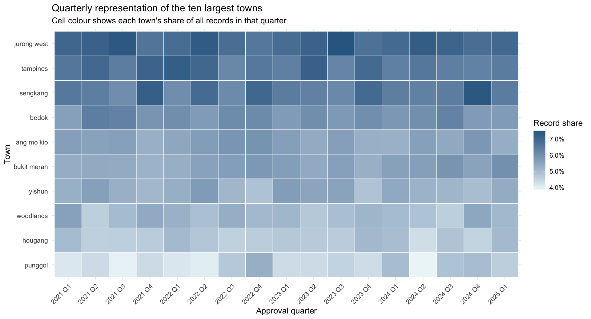

热力图仅展示整个训练集中记录数最多的十个 town。下表列出全部 26 个 town 中，早期至后期占比变化绝对值最大的十个。

|TOWN|早期占比（%）|后期占比（%）|变化（百分点）|
|:---|---:|---:|---:|
|punggol|4.24|4.79|0.55|
|sengkang|6.45|6.91|0.46|
|bukit merah|5.35|5.73|0.39|
|tampines|6.76|6.38|-0.38|
|clementi|3.62|3.28|-0.34|
|bedok|6.01|5.70|-0.31|
|queenstown|4.10|3.82|-0.28|
|central|1.32|1.58|0.26|
|yishun|5.42|5.16|-0.26|
|sembawang|2.32|2.58|0.26|

Town 构成的总变差距离为 **2.6 个百分点**。单个 town 中变化最大的是 `punggol`，占比增加 **0.55 个百分点**，说明地理分布总体较为稳定。

### 建筑面积构成

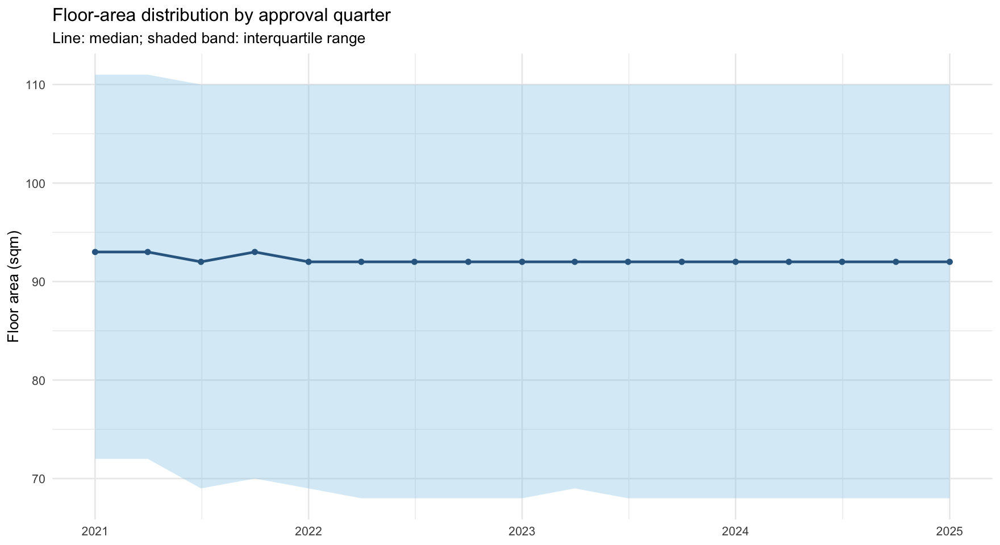

|窗口|记录数|第一四分位数（平方米）|中位数（平方米）|第三四分位数（平方米）|均值（平方米）|
|:---|---:|---:|---:|---:|---:|
|早期|19,250|72|93|111|94.7|
|后期|17,198|68|92|110|92.3|

建筑面积中位数由 **93 平方米**降至 **92 平方米**。四分位区间也略微下移，并未显示记录构成系统性地转向更大面积住房。

### 进度报告解读

合并记录的租金中位数上升 **57.5%**，不太可能主要由记录构成变化解释。Town 分布高度稳定，建筑面积中位数下降 **1 平方米**，最明显的类别变化也只是房型占比的温和调整。房型是构成变化最明显的变量：五房式占比下降，二房式和三房式占比上升。这种向较小房型移动的变化，并不能直接解释租金上升。以上均为描述性诊断，不是因果估计；未观测到的因素或更细粒度的房屋构成变化仍可能影响租金趋势。

## 12. 验证方案建议

应将本任务主要视为同时具有横截面与时间维度的监督式表格回归。一般模型比较可采用标准随机训练—验证划分或 K 折交叉验证；原始数据划分恰好按时间排序，并不意味着本任务属于纯时间序列预测。

另外，将最后六个月（**2024-10 至 2025-03**）设为时间留出集；如果计算资源允许，还可增加更早的滚动时间检查作为稳健性分析。这些检查衡量模型对时间相关分布漂移的敏感性，而不是假设观测值构成纯时间序列。模型比较应以比赛规定指标为主，并以 MAE 作为辅助诊断，同时按月份、town、房型和租金区间拆分误差。目标编码及其他任何基于目标变量计算的聚合特征，都必须只使用每次划分或每个验证折的训练部分拟合，再将映射应用于验证记录。

## 13. 优先结论与下一步实验

1. 数据跨越多个市场阶段，时间必须显式进入模型。
2. Town、房型和面积是第一批需要测试的核心预测变量。
3. 控制核心变量后，房屋模型和房龄可能继续提供非线性信号。
4. Street 和 block 可能有效，但需要使用防泄漏的编码，并对小样本类别进行正则化。
5. 添加辅助数据前，应先建立均值预测、线性模型和树模型等基线。
6. 辅助数据应通过独立的消融实验逐步加入：HDB block 属性、MRT、商场、学校，最后再考虑宏观变量。
7. 除非发现明确的数据错误，否则应保留高租金记录；RMSE 对其误差权重更高，应单独分析。

## 14. 分析局限

- 所有关系均为描述性关系，不能据此建立因果结论。
- 缺少交易标识符或额外说明，无法断定重复记录是否为错误。
- Town、房屋模型和房龄的表面效应可能部分来自时间、面积和房型构成差异。
- `FEE` 的业务含义仍未解决。
- 本轮分析有意排除了外部地理和宏观数据。

## 15. 可复现性与源数据完整性

本报告由 `scripts/run_eda.R` 基于 `data/train.csv` 生成。运行前后均校验了源数据集哈希值。报告生成时间为 2026-09-29 18:58:26 +08。
